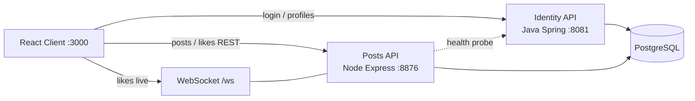
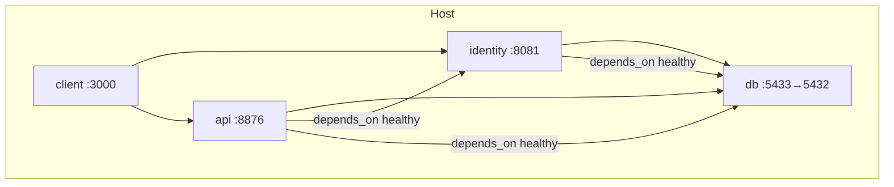
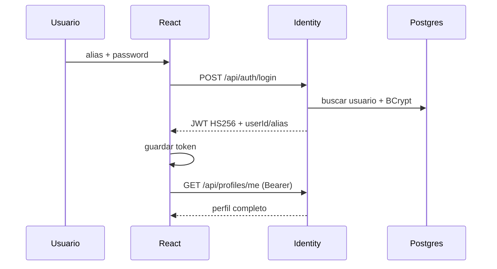
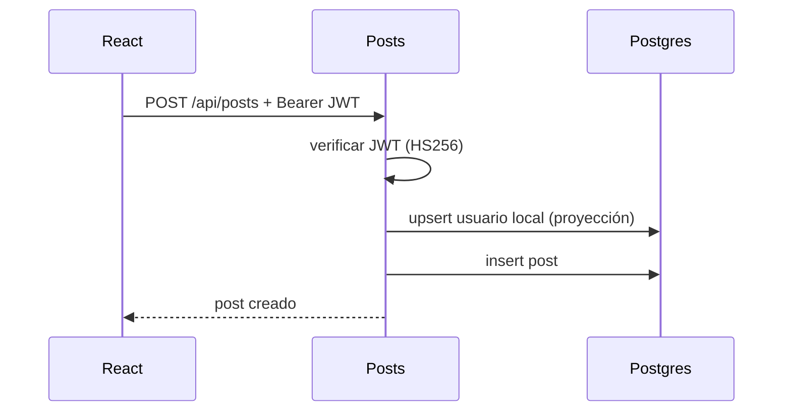
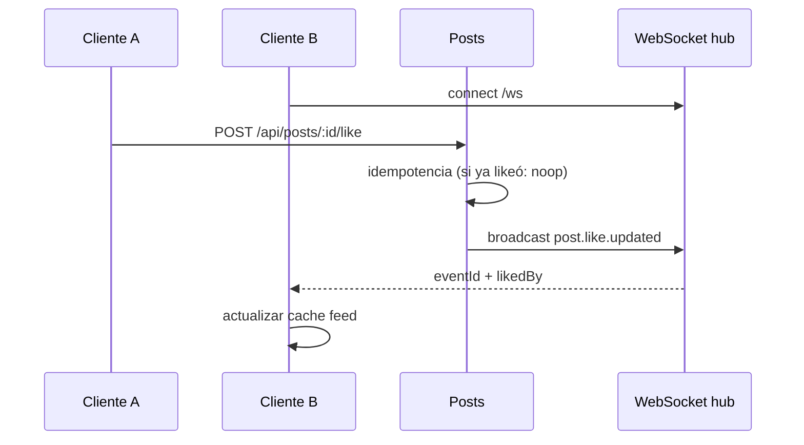

# Arquitectura — DEVEXP v2

## Decisiones

| Tema | Decisión | Por qué |
|------|----------|---------|
| Identity | Java 17 + Spring Boot | Requisito obligatorio del PDF; dominio auth/perfiles |
| Posts | Node.js + Express + TypeORM | Asincronía y WebSocket simples para likes |
| JWT | HS256 compartido (`JWT_SECRET`) | Verificación local en Posts sin acoplar a session store |
| Realtime | WebSocket en Posts | Menos infra que MQTT; suficiente para demo de likes |
| DB | PostgreSQL + schema `identity` | ORM + Flyway en Identity; TypeORM synchronize en Posts |
| Frontend | React (opcional) | UX; no reemplaza Java/Node |

## Diagrama de componentes

## Diagrama de despliegue (Docker Compose)

## Secuencia — Login

## Secuencia — Publicar

## Secuencia — Like en tiempo real

## Degradación

| Fallo | Comportamiento |
|-------|----------------|
| Identity down | Banner en UI; login/registro fallan con mensaje claro; Posts marca `degraded` en `/api/health` |
| Posts down | Banner; Identity sigue permitiendo login; feed no carga |
| DB down | Ambos APIs unhealthy; Compose healthchecks fallan |

Ver también [realtime-likes.md](realtime-likes.md).
