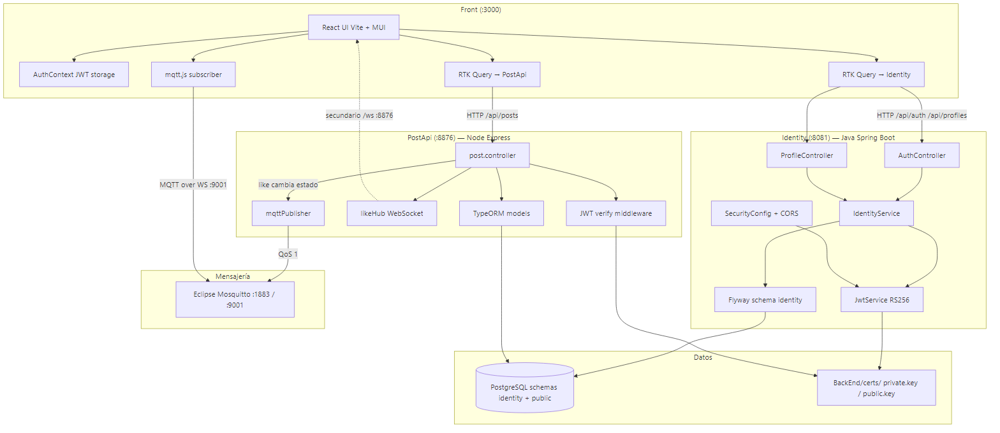
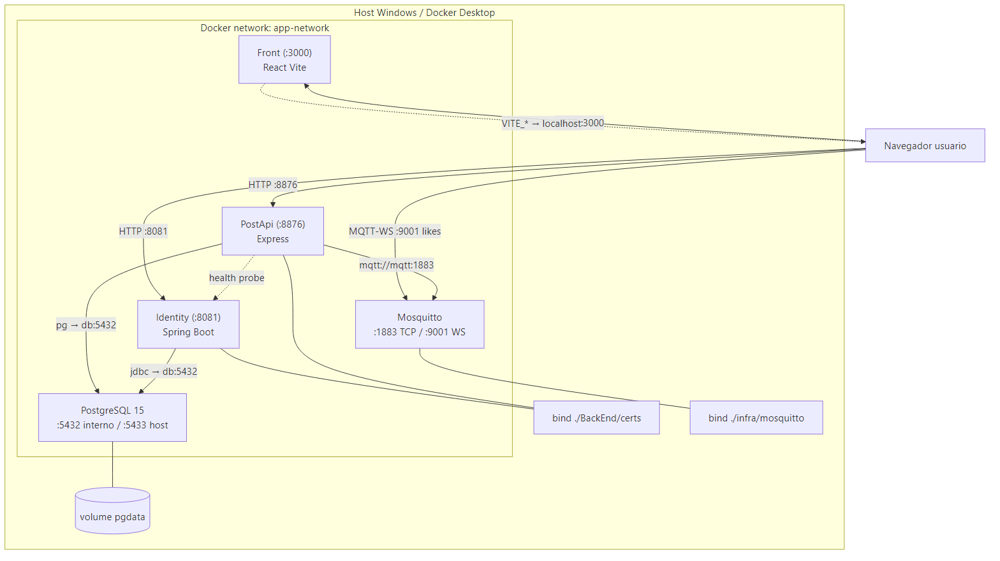
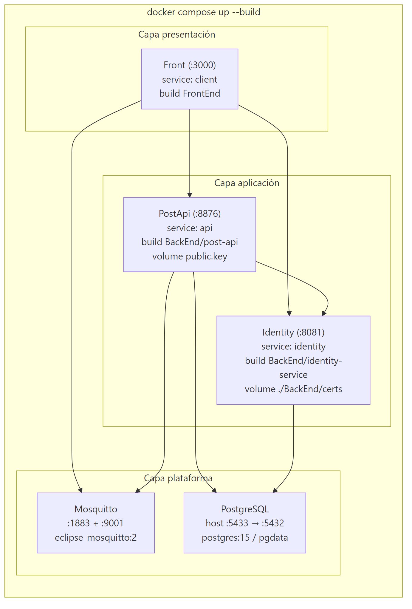

# Diagramas — DEVEXP v2

Carpeta de diagramas para documentación y sustentación.

## Imágenes PNG (entrega)

| Tipo | Archivo |
|------|---------|
| Secuencia — registro | [images/01-secuencia-registro.png](images/01-secuencia-registro.png) |
| Secuencia — login + perfil | [images/01-secuencia-login.png](images/01-secuencia-login.png) |
| Secuencia — posts | [images/01-secuencia-posts.png](images/01-secuencia-posts.png) |
| Secuencia — like MQTT | [images/01-secuencia-like-mqtt.png](images/01-secuencia-like-mqtt.png) |
| Componentes | [images/02-componentes.png](images/02-componentes.png) |
| Infraestructura | [images/03-infraestructura.png](images/03-infraestructura.png) |
| Despliegue | [images/04-despliegue.png](images/04-despliegue.png) |

### Vista rápida







## Markdown + Mermaid (editable)

| Archivo | Tipo |
|---------|------|
| [01-secuencia.md](01-secuencia.md) | Secuencia |
| [02-componentes.md](02-componentes.md) | Componentes |
| [03-infraestructura.md](03-infraestructura.md) | Infraestructura |
| [04-despliegue.md](04-despliegue.md) | Despliegue |

Fuente Mermaid: `mmd/*.mmd`. Regenerar PNG:

```powershell
cd docs/diagramas
npx @mermaid-js/mermaid-cli@11.4.2 -i mmd/02-componentes.mmd -o images/02-componentes.png -c mmd/mermaid-config.json -p mmd/puppeteer.json -b white -s 2
```

Relacionado: [../architecture.md](../architecture.md) · [../realtime-likes.md](../realtime-likes.md)
